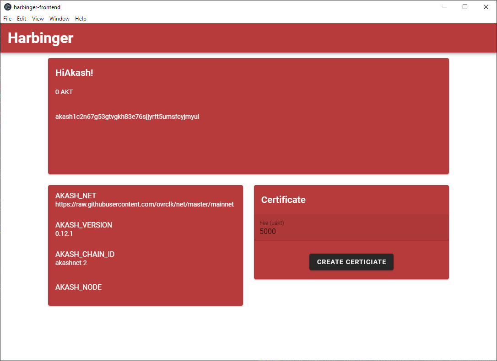

# Harbinger
An Akash deployment Electron app built using Sqlite, Express, Vue, and Node.

* [Hackathon Write-Up / Greater Project Summary](./docs/hackathon.md)
* [Installation Instructions](./docs/installation.md)

## Early Development Frontend Images

#### Frontend with wallets.

---

#### All backend tests passing! :)

---

#### Mnemonic display after wallet creation.

---

#### Backend debug mode with API logging.

---

#### Wallet details. This is where more app functionality will be added later.

---

## Acknowledgements

Huge thank you to Marcos Henrique da Silva over at toptal.com for his awesome tutorial on REST API development (link to first article below). I used parts of his code base extensively to bootstrap my backend.

https://www.toptal.com/express-js/nodejs-typescript-rest-api-pt-1